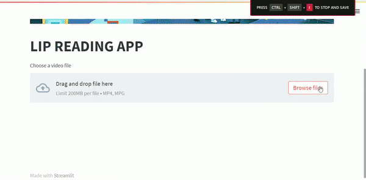

# AI LIP READER

This project is an AI that can read a persons lip and figure out what the person was saying. It uses Mediapipe to get the keypoints of a persons mouth and crops a suitable section where the movement of the lips can be seen.

It is trained on a neural network that consists of timedistribution and bidirectional lstm layers. The network uses a CTC (Connectionist Temporal Classification) loss function which is a commonly used in neural network models used for sequence to sequence tasks such as speech recognition, handwriting recognition, and machine translation.

## Installation
Install the required packages: pip install -r requirements.txt

## Usage
A streamlit app is created for its useage. The model weights is loaded and with the given video it determines what the subject was trying to say.

streamlit demo of how it works

this is what is inputted into the model

## Project Status
This project is currently in development. The model is trained on 999 videos and there are still more to train on, this currently my first version.

## Acknowledgments
I would like to thank Yannis M. Assael1, Brendan Shillingford1, Shimon Whiteson & Nando de Freitas. Inspired by their research paper (https://arxiv.org/pdf/1611.01599v2.pdf), I was able to create this project.

## Further Updates
As of 13-04-2023, this is my 1st version. I will be further developing this model by making it learn with more data.
And would also create a docker container for this project
